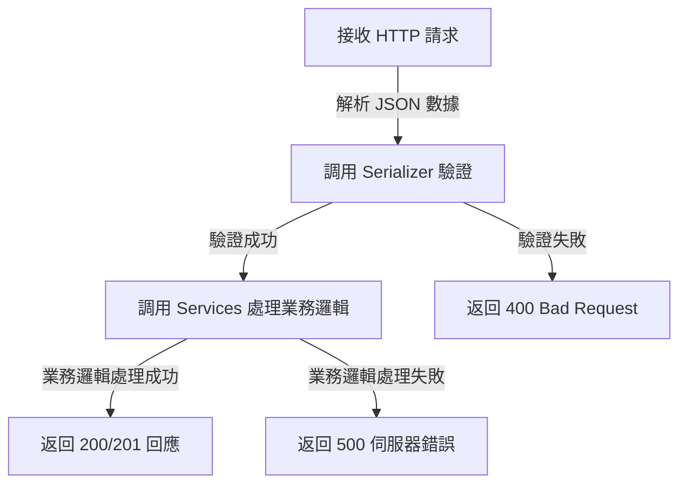

# 設計說明

## views.py
### 主要負責
- 流程控制（根據請求方法執行不同的操作）
- 調用 serializer 進行資料驗證
- 調用 services.py 處理業務邏輯
- 返回適當的 HTTP 回應（200、400、500 等）
- 處理請求者身份驗證與權限管理（authentication、permissions）

### 工作流程

### 為什麼 `views.py` 只負責調用 serializer 與 services？
📌 讓 `views.py` 簡潔：

views.py 只負責請求與回應的流程控制，避免業務邏輯混雜其中。
這樣當業務邏輯變更時，只需修改 `services.py`，而不影響 `views.py`。

📌 提高可重用性：

`services.py` 內的 `create_user()` 方法可以被不同的 API 或後台管理功能重用，而不需要複製邏輯。

📌 簡化測試：
- 測試 `views.py`：只需測試請求與回應，不用測試細節業務邏輯。
- 測試 `serializers.py`：確保欄位驗證正確。
- 測試 `services.py`：獨立測試業務邏輯，不依賴 HTTP 請求。

## serializers.py
### 主要負責
- 資料驗證（validate）
- 序列化（將 Python 物件轉換為 JSON）
- 反序列化（將 JSON 轉換為 Python 物件）
與 ModelSerializer 結合，處理 `create()` 和 `update()`
### 適合放入 `serializers.py` 的邏輯
- 單一欄位的基本驗證（如格式、長度、類型檢查）
- 跨欄位的簡單驗證（如密碼與確認密碼是否相同）
- API 輸入輸出數據結構的定義

## validators.py
### 主要負責
- 單一欄位或簡單跨欄位的獨立驗證
- 可以被 serializers.py 或 models.py 多次重用
- 不應該涉及資料庫查詢或業務邏輯

### 適合放入 `validators.py` 的邏輯
- 單欄位驗證（如台灣手機號碼格式、密碼強度）
- 簡單跨欄位驗證（如 start_date 不能晚於 end_date）
- 正規表達式驗證（如 email、台灣身份證字號）

## services.py
### 主要負責
- 複雜的業務邏輯處理
- 需要存取資料庫的驗證（如檢查 email 是否已存在）
- 跨 API 或跨模型的邏輯（如計算訂單折扣、庫存檢查）
- 與外部 API 或系統的交互（如發送驗證碼）

### 適合放入 `services.py` 的邏輯
- 存取資料庫的驗證（如檢查 email 是否存在）
- 處理需要與多個模型互動的業務邏輯
- 與外部系統整合（如發送 email、SMS）

## 總結
- `validators.py`：負責欄位級別的驗證，處理格式、長度、正則表達式等簡單驗證，可在 `serializers.py` 或 `models.py` 中重用。
- `views.py`：負責請求與回應的流程控制，接收 HTTP 請求、調用 `serializers.py` 進行驗證、調用 `services.py` 處理業務邏輯，並返回適當的 HTTP 回應。
- `services.py`：負責業務邏輯與資料庫操作，處理複雜的邏輯運算、與外部 API 交互、查詢或更新資料庫，以保持 `views.py` 輕量化。
- `serializers.py`：負責資料的序列化、反序列化與驗證，將 Python 物件轉換為 JSON，並驗證 API 請求數據的完整性和正確性，可包含跨欄位驗證邏輯。